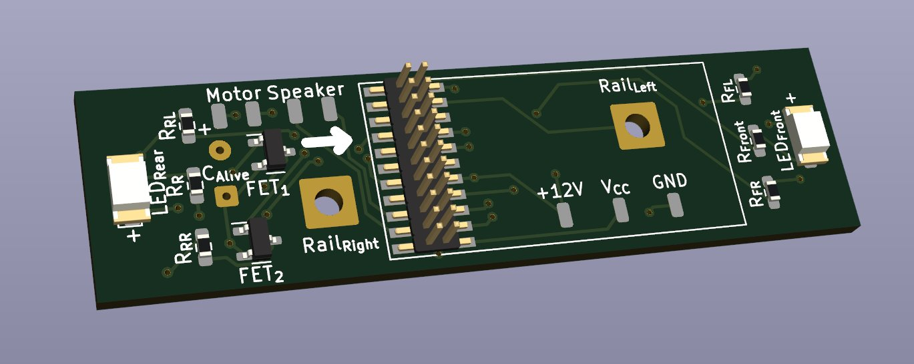

# DCC 21MTC Adapter Board for Kato 1-310



## Order to Elecrow

Rename and archive gerber files:

```
make
```

_dcc-adapter-board-kato-1.310-21mtc_elecrow.zip_ will be made and this is a file to submit to Elecrow.

Order parameters are:

Parameter | Argument
---|---
Layer | 2
Dimensions | 60×16
Thickness | 1.0
Color | Black
Surface Finish | HASL
Castellated Hole | No
Copper Weight | 1

## License

[CC BY 4.0](https://creativecommons.org/licenses/by/4.0/deed) 岡本和樹

[Open Source Hardware](https://www.oshwa.org/)
